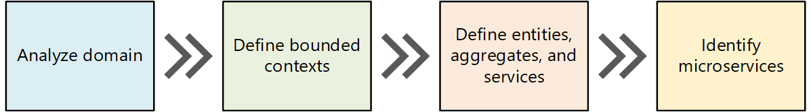
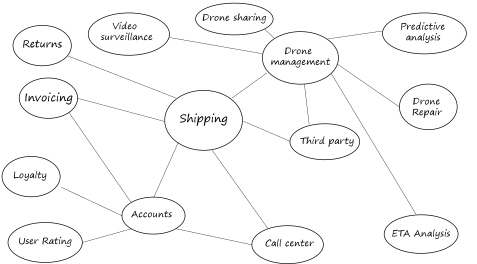
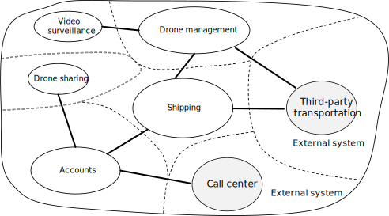
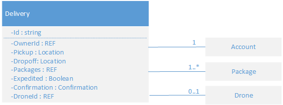
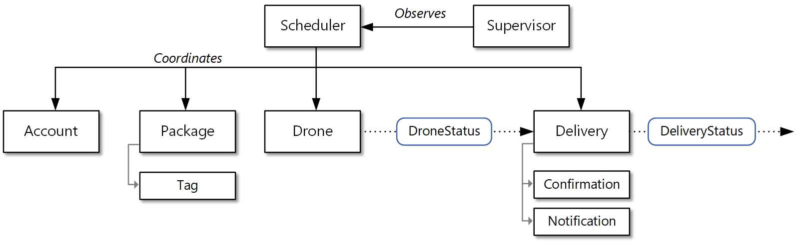
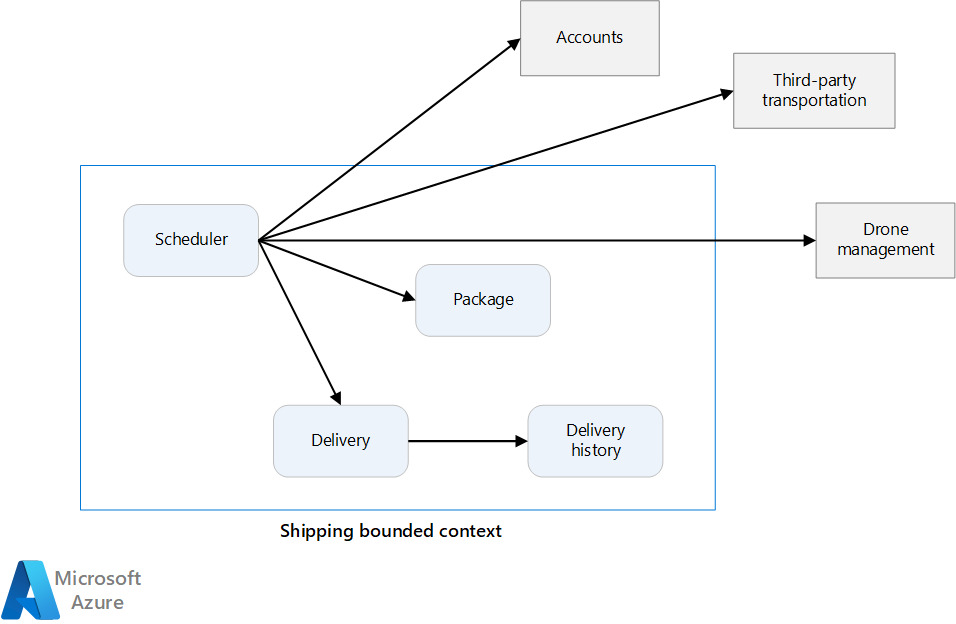
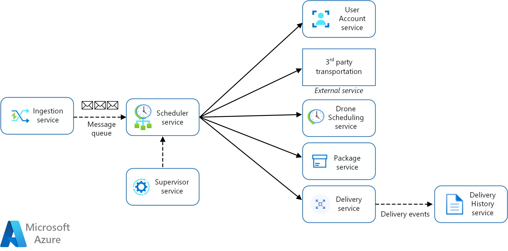

## 使用域分析对微服务进行建模

微服务的最大挑战之一是定义各个服务的边界。 一般的规则是服务应该只做“一件事”，但是，实践这条规则需要经过认真的考虑。 没有任何机械性的流程可以生成“适当的”设计。 必须深入考虑业务域、要求和目标。 否则，最终可能得到一个杂乱无章的设计，它呈现一些不需要的特征，例如隐藏服务之间的依赖关系、紧密耦合，或者界面的设计不佳。 本文介绍设计微服务的域驱动方法。

本文以无人机交付服务为例进行讨论。 可以在此处阅读有关方案和相应参考实现的详细信息。

### 简介

应该围绕业务功能而不是数据访问或消息传递等水平层来设计微服务。 此外，微服务应具有低耦合高内聚的特点。 如果在更新一个服务时无需同时更新其他服务，则该微服务是低耦合的。 如果微服务的职责单一且定义完善，例如管理用户帐户或跟踪交付历史记录，则它是高内聚的。 服务应该封装领域知识，使这些领域知识对于客户端而言处于抽象状态。 例如，客户端应该能够在无需知晓派遣算法或如何管理无人机群的情况下安排无人机。

领域驱动设计 (DDD) 提供一个框架，可以让你顺利访问一组设计完善的微服务。 DDD 包括两个不同的阶段：战略和战术。 在 DDD 的战略模式中，可以定义系统的大规模结构。 战略模式有助于确保体系结构专注于业务功能。 策略性 DDD 提供一组可用于创建域模型的设计模式。 这些模式包括实体、聚合和领域服务。 借助这些战术模式，可以设计低耦合高内聚的微服务。

本文和下一篇文章将引导你完成以下步骤，并将其应用到无人机交付应用程序：

我们首先分析业务领域，以了解应用程序的功能要求。 该步骤输出领域的非正式说明，可将其优化成更正式的一组领域模型。

接下来，定义领域的边界上下文。 每个边界上下文包含一个领域模型，该模型表示较大应用程序的特定子域。

在边界上下文中，应用战术 DDD 模式以定义实体、聚合和域服务。

使用前一步骤的结果可以标识应用程序中的微服务。

本文介绍前三个步骤，并重点讨论 DDD。 下一篇文章将介绍如何标识微服务。 但是，请务必记住，DDD 是迭代的持续过程。 服务边界不是一成不变的。 随着应用程序的演变，你可以决定将某个服务分解成多个较小服务

### 场景：无人机交付

Fabrikam, Inc. 正在推出无人机交付服务。 该公司经营无人机群。 各商家注册该服务，用户可以请求无人机收取要交付的商品。 当客户安排取件时，后端系统会分配一架无人机，并将估计的交付时间告知用户。 在交付过程中，客户可以通过持续更新的 ETA 跟踪无人机的位置。

此方案涉及到一个相当复杂的域。 部分业务难题包括安排无人机、跟踪包裹、管理用户帐户，以及存储和分析历史数据。 此外，Fabrikam 希望快速投放市场和扩张，同时添加新功能。 该应用程序需要以云的规模运行，并附带较高的服务级别目标 (SLO)。 此外，Fabrikam 预期系统的不同部件在数据存储和查询方面具有截然不同的要求。 所有这些考虑因素促使 Fabrikam 为无人机交付应用程序选择了微服务体系结构。

### 分析领域

借助 DDD 方法可以设计微服务，使每个服务原生都能符合业务功能要求。 此方法有助于避免组织边界或技术选择左右你的设计。

在编写任何代码之前，需要获取所创建的系统的鸟瞰图。 DDD 模式首先对业务进行领域建模，然后创建领域模型。 领域模型是业务领域的抽象模型。 它可以提取和组织领域知识，并为开发人员和领域专家提供通用语言。

首先，映射所有业务功能及它们之间的连接。 这可能是涉及到领域专家、软件架构师和其他利益干系人的协作性工作。 无需使用任何特定的形式。 可以直接草绘或者在白板上绘制关系图。

在填充关系图时，可以开始标识离散的子域。 哪些功能密切相关？ 哪些功能是业务的核心？哪些功能提供辅助服务？ 什么是依赖项关系图？ 在此初始阶段，不需要考虑技术或实施细节。 也就是说，应该注意应用程序要在哪个位置与 CRM、付款处理或计费系统等外部系统集成。

### 示例：无人机交付应用程序

完成一些初始域分析之后，Fabrikam 团队绘制了一份描绘无人机交付域的草图。

* “交货”位于关系图的中心，因为它是业务的核心。 关系图中的其他任何元素都是为了支持此功能。
* “无人机管理”也是业务的核心。 与无人机管理密切相关的功能包括无人机维修，以及使用预测分析来预测无人机何时需要检修和维护。
* ETA 分析提供取件和交货的估计时间。
* 如果包裹无法完全由无人机交货，则应用程序可以通过第三方运输来安排替代的运输方式。
* 无人机共享是核心业务的可能扩展。 公司的无人机在某些时段可能容量过剩，在这种情况下，可以出租无人机，以避免闲置。 初始版本未包括此功能。
* 视频监督是公司以后可以拓展到的另一个领域。
* 用户帐户、开票和呼叫中心是支持核心业务的子域。

请注意，在此流程的此阶段，我们尚未做出有关实施或技术的任何决策。 某些子系统可能涉及到外部软件系统或第三方服务。 即便如此，应用程序也需要与这些系统和服务进行交互，因此，必须将它们包含在领域模型中。

!!! info
    如果应用程序依赖于外部系统，则存在一种风险：外部系统的数据架构或 API 会渗入应用程序，最终暴露了体系结构设计。 不遵循最佳实践，并使用复杂数据架构或过时 API 的旧式系统尤其如此。 在这种情况下，必须在这些外部系统与应用程序之间妥善定义边界。 为此，请考虑使用 Strangler Fig 模式或防损层模式。

### 定义边界上下文

领域模型将包含现实世界中事物的表示形式 - 用户、无人机、包裹，等等。 但这并不意味着系统的每个部分都需要对相同的事物使用相同的表示形式。

例如，处理无人机维修和预测分析的子系统需要呈现无人机的许多物理特征，例如其维护历史记录、里程、机龄、型号、性能特征，等等。 但是，在安排交付时，我们并不需要关心这些方面。 计划子系统只需知道无人机是否可用，以及取件和交货的 ETA。

如果尝试为这两个子系统创建了单个模型，则会不必要地增大复杂性。 此外，模型会更难得到发展，因为任何更改都需要满足处理不同子系统的多个团队的要求。 因此，更好的做法通常是设计不同的模型，用于在两种不同的上下文中呈现相同的真实实体（在本例中为无人机）。 每个模型仅包含其特定上下文中相关的功能和属性。

在此场合下，“边界上下文”的 DDD 概念可以派上用场。 边界上下文只是应用特定领域模型的领域中的边界。 在上图中，我们可以根据各种功能是否共享单个领域模型将功能分组。

边界上下文不一定相互独立。 在此图中，连接边界上下文的实线表示两个边界上下文交互的位置。 例如，“交货”依赖于“用户帐户”来获取有关客户的信息，并依赖于“无人机管理”来安排机群中的无人机。

在 Domain Driven Design（领域驱动设计）一书中，Eric Evans 描述了当某个领域模型与另一个边界上下文交互时，保持该模型完整性的多种模式。 微服务的主要原则之一是服务通过完善定义的 API 进行通信。 此方法对应于两种模式，即 Evans 所说的“开放主机服务”和“发布语言”。 “开放主机服务”的思路是子系统针对与它通信的其他子系统定义一个正式协议 (API)。 “发布语言”扩展了这种思路，它以其他团队可以用来编写客户端的形式发布 API。 为微服务设计 API 一文介绍了如何使用 OpenAPI 规范（以前称为 Swagger）来为 REST API 定义语言无关的接口说明（以 JSON 或 YAML 格式表示）。

## 使用战术性 DDD 来设计微服务

在域驱动设计 (DDD) 的战略阶段，我们要绘制业务域的关系图，并定义域模型的边界上下文。 在战术 DDD 阶段，需要更精确地定义领域模型。 战术模式在单个边界上下文中应用。 在微服务体系结构中，我们对实体和聚合模式特别感兴趣。 应用这些模式有助于标识应用程序中服务的自然边界（请参阅本系列的下一篇文章）。 作为一般原则，微服务应小于聚合，且不大于边界上下文。 首先，让我们了解战术模式。 然后，我们对无人机交付应用程序中的“交货”边界上下文应用这些模式。

### 战术模式概述

本部分提供战术 DDD 模式的简要概述，如果你已熟悉 DDD，则可以跳过本部分。 Eric Evans 著作的第 5 - 6 章，以及 Vaughn Vernon 的 Implementing Domain-Driven Design（实施域驱动的设计）一书中更详细地介绍了这些模式。

**实体**。 实体是一直保持唯一标识的对象。 例如，在银行应用程序中，客户和帐户就是实体。
  * 实体在系统中有唯一的标识符，使用该标识符可以查找和检索该实体。 这并不意味着，该标识符始终直接向用户公开。 它可能是数据库中的 GUID 或主键。
  * 一个标识可以跨多个边界上下文，并可能保留到应用程序生存期结束之后。 例如，银行帐号或政府颁发的身份证号不会与特定应用程序的生存期相关联。
  * 实体的属性可随时变化。 例如，某人的姓名或地址可能有变化，但他（她）仍是同一个人。
  * 一个实体可以包含对其他实体的引用。

**值对象**。 值对象没有标识。 它只由其属性值定义。 值对象也是不可变的。 若要更新值对象，始终需要创建一个新实例来替换旧实例。 值对象可以包含用于封装域逻辑的方法，但这些方法不应该给对象的状态产生负面影响。 值对象的典型示例包括颜色、日期时间和货币值。

**聚合**。 聚合定义一个或多个实体的一致性边界。 一个聚合只包含一个根实体。 可以使用根实体的标识符执行查找。 聚合中的其他任何实体是根的子级，由从根开始的后续指针引用。

聚合的作用是为事务不变性建模。 现实世界中的事物具有复杂的关系。 客户创建订单，订单包含产品，产品有供应商，等等。 如果应用程序修改了多个相关对象，它如何保证一致性？ 如何跟踪并实施不变性？

传统应用程序通常使用数据库事务来实施一致性。 但是，在分布式应用程序中，这种做法通常不可行。 单个业务事务可能跨越多个数据存储、长时间运行，或者涉及第三方服务。 最终由应用程序而不是数据层来实施域所需的不可变性。 这就是要为聚合建模的目的。

!!! info
    聚合可以包含单个实体且不包含子实体。 聚合的定义由事务边界确定。

*领域服务和应用服务*。 在 DDD 术语中，服务是实现某种逻辑且不保存任何状态的对象。 Evans 对封装领域逻辑的领域服务，以及提供技术功能（例如用户身份验证或发送短信）的应用服务做了区分。 领域服务通常用于对跨多个实体的行为建模。

!!! info
    软件开发中广泛使用了“服务”一词。 此处的定义不直接与微服务相关。

**领域事件**。 发生某种情况时，可以使用领域事件来通知系统的其他部件。 顾名思义，领域事件应该表示领域中发生的某些情况。 例如，“在表中插入了记录”不是领域事件。 “已取消交付”是领域事件。 领域事件与微服务体系结构密切相关。 由于微服务为分发式且不共享数据存储，领域事件可为微服务提供相互协调的途径。 服务间通信一文更详细介绍了异步消息传递。

还有其他几种 DDD 模式未在此处列出，包括工厂、仓储和模块。 实施微服务时，这些模式可能十分有用；但是，在微服务之间设计边界时，它们作用不大。

### 无人机交付：应用模式

首先，我们探讨“交货”边界上下文必须处理的方案。

* 某个客户可以请求派遣无人机从已注册到无人机交付服务的公司取件。
* 寄件人生成了一个标记（条形码或 RFID）并粘贴在包裹上。
* 无人机将会收取包裹，然后将包裹从源位置交付到目标位置。
* 当客户安排交付时，系统将会根据路线信息、天气情况和历史数据提供 ETA。
* 当无人机起飞时，用户可以跟踪当前位置和最新的 ETA。
* 在无人机收取包裹之前，客户可以取消交付。
* 完成交付时，客户将收到通知。
* 寄件人可以请求客户提供签名或指纹形式的交付信息。
* 用户可以查找已完成交付的历史记录。

在这些方案中，开发团队确定了以下实体。

* 交付
* 包裹
* 无人机
* 帐户
* 确认
* 通知
* 标记

前四个项（“交付”、“包裹”、“无人机”和“帐户”）都是表示事务一致性边界的*聚合*。 “确认”和“通知”是“交付”的子实体，“标记”是“包裹”的子实体。

此设计中的*值对象*包括“位置”、“ETA”、“包裹重量”和“包裹大小”。

为便于演示，下面提供了“交付”聚合的 UML 关系图。 请注意，该聚合包含对其他聚合（包括“帐户”、“包裹”和“无人机”）的引用。

有两个领域事件：

* 当无人机起飞时，“无人机”实体将发送 DroneStatus 事件，用于描述无人机的位置和状态（飞行中、已着陆）。

* 每当交付阶段发生更改时，“交付”实体将发送 DeliveryTracking 事件。 这些事件包括 DeliveryCreated、DeliveryRescheduled、DeliveryHeadedToDropoff 和 DeliveryCompleted。

请注意，这些事件描述领域模型中有意义的事物。 它们描述有关域的某些信息，但不与特定的编程语言构造相关。

开发团队还确定了另一个功能领域，但该功能领域并不与前面所述的任何实体紧密相关。 系统的某个部分必须协调有关安排或更新交付的所有步骤。 因此，开发团队在设计中添加了两个域服务：一个计划程序（用于协调步骤），以及一个监督程序（用于监视每个步骤的状态，以检测是否有任何步骤失败或超时）。这是计划程序代理监督程序模式的一个变体。

## 识别微服务边界

微服务的适当大小是什么？ 人们常说“不要太大，也不要太小”，这固然是正确的说法，但实际上没有太大意义。 但是，如果从一个精心设计的领域模型着手，则规划出微服务就容易得多。

### 从领域模型到微服务

我们为无人机交付应用程序定义了一组边界上下文。 然后，我们更详细地探讨了其中的某个边界上下文（“交货”边界上下文），并为该边界上下文标识了一组实体、聚合和领域服务。

现在，我们可以从领域模型转到应用程序设计。 下面是一个用于从域模型派生微服务的方法。

1. 从限定上下文开始。 通常，微服务中的功能不应跨多个限定上下文。 根据定义，边界上下文标记特定领域模型的边界。 如果你发现微服务混用了不同的领域模型，可能意味着需要重新进行领域分析以优化领域模型。

2. 接下来，查看领域模型中的聚合。 聚合通常是微服务的适当候选项。 合理设计的聚合能够体现一个设计优良的微服务的许多特征，例如：

   * 聚合派生自业务要求，而不是数据访问或消息传递等技术因素。
   * 聚合应具有较高的功能内聚性。
   * 聚合是持久性的边界。
   * 聚合应为松散耦合。

3. 域服务也是微服务的适当候选项。 域服务是跨多个聚合的无状态操作。 典型的示例是涉及多个微服务的工作流。 我们将在无人机交付应用程序中看到此示例。

4. 最后，考虑非功能性要求。 分析团队规模、数据类型、技术、可伸缩性要求、可用性要求和安全要求等因素。 这些因素可能导致需要进一步将微服务分解成两个或更多个较小服务，或执行相反的操作，即，将多个微服务合并成一个。

在应用程序中标识微服务之后，请根据以下条件验证设计：

* 每个服务承担单一责任。
* 服务之间不存在琐碎的调用。 如果将功能拆分成两个服务会导致它们过度琐碎，该症状的原因可能是这些功能属于同一个服务。
* 每个服务足够小，独立工作的小团队即可构建它。
* 两个或更多个服务的部署不应该存在相互依赖的关系。 应该始终可以在不重新部署其他任何服务的情况下部署某个服务。
* 服务未紧密耦合，可独立演变。
* 服务边界不会造成数据一致性或完整性方面的问题。 有时，必须通过将功能放入单个微服务来保持数据一致性。 话虽如此，但应该是否确实需要强一致性。 可通过某些策略来解决分布式系统中的最终一致性，分解服务的好处通常比管理最终一致性所存在的挑战更具效益。

最重要的是，必须追求实用，并记住领域驱动的设计是一个迭代过程。 如果有疑问，可以从更粗粒度的微服务入手。 将微服务拆分成两个较小服务比跨多个现有微服务来重构功能更方便。

### 示例：为无人机交付应用程序定义微服务

回顾一下，前面开发团队已标识四个聚合（“交付”、“包裹”、“无人机”和“帐户”）和两个领域服务（“计划程序”和“监督程序”）。

“交付”和“包裹”是微服务的突出候选项。 “计划程序”和“监督程序”协调其他微服务执行的活动，因此，将这些领域服务实施为微服务比较有利。

“无人机”和“帐户”比较特别，它们属于其他边界上下文。 一种做法是让“计划程序”直接调用“无人机”和“帐户”边界上下文。 另一种做法是在“交货”边界上下文中创建“无人机”和“帐户”微服务。 这些微服务通过公开更适合“交货”上下文的 API 或数据架构，在边界上下文之间充当中介。

“无人机”和“帐户”边界上下文的详细信息超出了本指南的范畴，因此我们在参考实现中创建了它们的模拟服务。 但在此情况下，需考虑一些因素：

  * 直接调入其他边界上下文会产生多大的网络开销？

  * 其他边界上下文的数据架构是否适用于此上下文，或者，专门针对此边界上下文定制一个架构是否更好？

  * 其他边界上下文是否为旧式系统？ 如果是，则可以创建一个充当防腐层的服务，用于在旧式系统与新式应用程序之间进行转换。

  * 团队结构是什么？ 是否能够方便地与负责其他边界上下文的团队通信？ 如果不是，创建一个充当两个上下文之间的中介的服务可能有助于降低跨团队通信所产生的成本。

到目前为止，我们尚未考虑任何非功能性要求。 考虑到应用程序的吞吐量要求，开发团队决定创建一个负责引入客户端请求的独立“引入”微服务。 此微服务将传入的请求放入缓冲区进行处理，以此实施负载调节。 计划程序将从缓冲区读取请求，并执行工作流。

非功能性要求使得团队必须额外创建一个服务。 到目前为止，所有服务都与包裹的实时安排和交付过程相关。 但是，系统还需要在长期存储中存储每项交付的历史记录，以进行数据分析。 团队认为这是交付服务的责任。 但是，历史分析与现行操作的数据存储要求有较大的差别（请参阅数据注意事项）。 因此，团队决定创建一个独立的交付历史记录服务，用于侦听来自交付服务的 DeliveryTracking 事件，并将这些事件写入长期存储。

下图展示了现阶段的设计：

### 后续步骤

此时，应对设计中每个微服务的用途和功能有一个清晰的认识才可以构建系统。