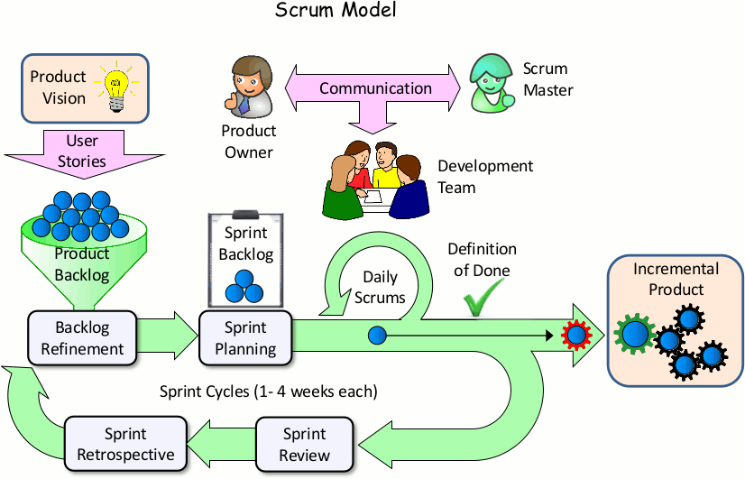
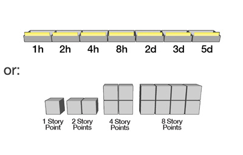

### 估算指标的定义

大概7年前公司项目开始全面推行敏捷开发，当时我们从未想过一个开发流程会进行的如此不顺利。而Scrum Methodoloty在几天的培训过程中虽看起来比较清晰易懂，但实际运作起来我们发现总会遇到这样或那样的问题，光Sprint Planning Meeting中的估算着实让我们头疼了很久。

如何进行有效的估算成为运作成功的Scrum方法学的一个关键因素。与传统的项目管理使用人天或人月的方式进行项目的估算方式不同，Scrum中的估算应以用户故事的难易级别来划分，我们常用的有如下几种：
- 数字大小 （1 - 10）
- 衣服大小 （XS, S, M, L, XL, XXL, XXXL)
- 斐波那契数列 （1, 2, 3, 5, 8, 13, 21, 34）

虽然Scrum框架并未限定不能用人天这种时间单位作为估算指标，但根据以下经验作者不推荐使用。

1. 我们很难估算一个精确的时间到每个任务上，因为每个Scrum成员的技术背景，经验，效率不尽相同，每个人对需求的理解也可能不同，估算出的时间可能相差很大。
2. 如下图，我们估算一个任务大概要6个小时那么任务应该落入8小时的桶中，那么就可能存在超估或欠估的情况。
3. 估算的目的是我们能够通过Burndown和Velocity图去评估和跟踪每个Sprint的进展情况，进而找出改善Sprint运作效率的点，而不是限定每个成员一定要做多少工作量的任务，与传统的计划驱动的项目有本质的区别。在燃尽图中的体现因是多少用户故事已被完成，而不是燃尽了多少的时间，因为时间的盒子已通过Sprint的2周或3周被定义了。
4. 成员在Sprint中每天填入工作在某任务上的时间一旦与估算的时间联系在一起，就会存在过早燃尽估算时间或多余时间，那么就可能在Sprint中需要频繁的调整估算。

### 估算流程

估算的指标定义好后，Scrum团队应找出一个基准点，这个基准点可以是某一个较小的任务如一个用户的增删改查页面。这里强烈建议定义Sprint 0做为试运行Sprint,处理预先应找出的合理定义内容,并处理项目流程或开发工具或环境相关的内容。然后Scrum团队根据Definition of Done每个人都应对每个用户故事进行估算，因为QA,开发，产品经理，部署人员对一个故事的理解是不同的，从他们每个人视角看到的内容可能也是不同的，如果相差较大应各自阐述理由并协商找出相对合理的大小。如果在估算中识别出某一个用户故事确实较复杂或Size较大，那么就需要与Product Owner协商进行再次切割，从而反向推动产品Backlog的完善和合理化。有些Scrum团队在估算中使用打牌的方式，其实Scrum并未定义以何种方式做估算，这个取决于每个Scrum Master的风格，只要团队认可就行，实际上我们经常要运行一段时间进行调整，从而也需要迭代的方式优化我们Scrum运作方式。

### 结语

最后，作者的观点是敏捷方法学不是解决所有项目上问题的银弹，也许它能够改善项目运行的情况也许会带来灾难。应在运作过程中根据实际情况进行裁剪或修改，只保证框架的运行即可不用过于吹毛求疵。而Scrum Master除了维护框架运作外，尽量给予团队更多的自我进化的空间，因为项目的成功最主要的因素还是人。